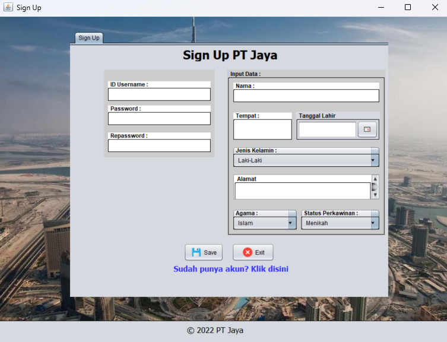
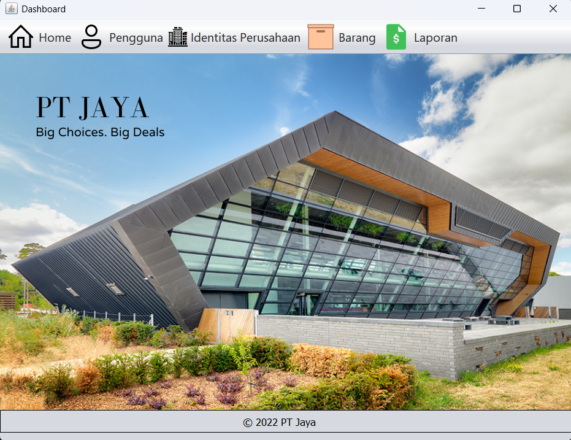
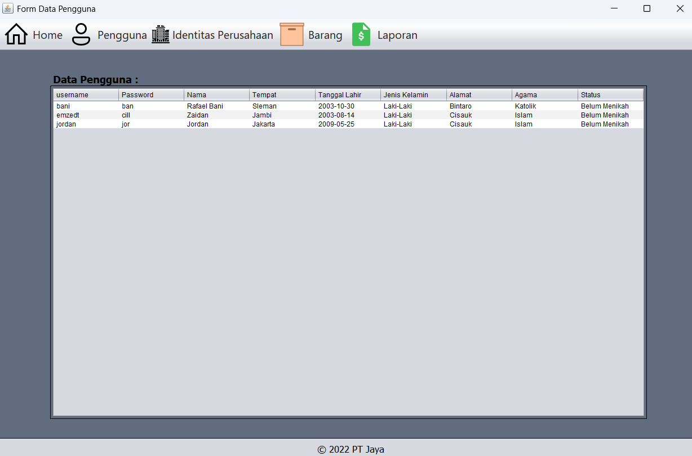
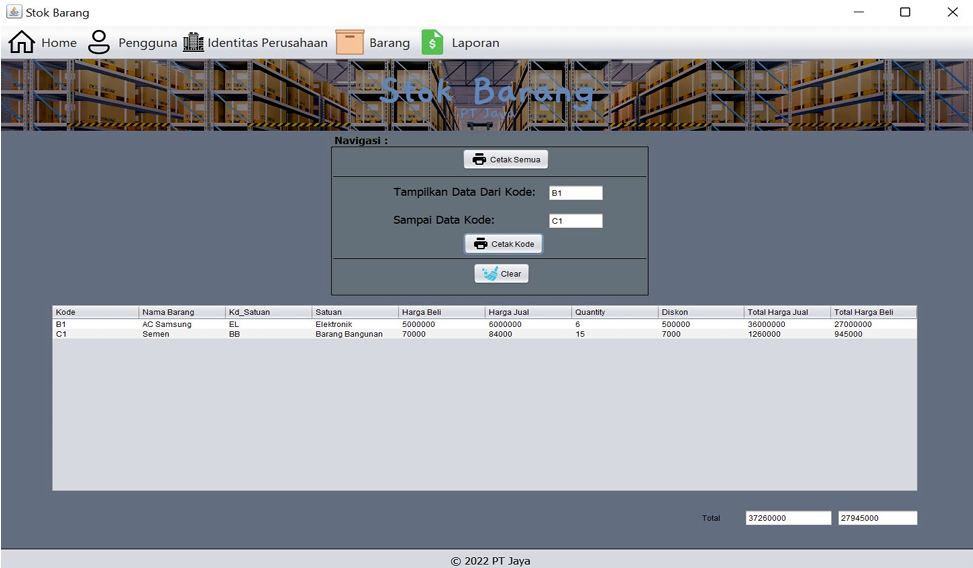
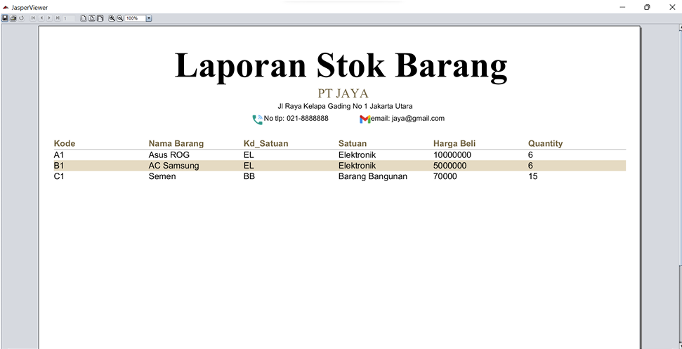

# 📦 Aplikasi Stok Barang PT Jaya

Ini adalah proyek UAS (Ujian Akhir Semester) untuk mata kuliah **Pemrograman Berorientasi Objek**, dikembangkan oleh **Muhammad Zaidan (31210053)** dari **Program Studi Sistem Informasi**, Fakultas Teknologi dan Desain, **Universitas Bunda Mulia** pada tahun 2022.

---

## 📌 Deskripsi Aplikasi

Aplikasi ini merupakan sistem **desktop berbasis Java** untuk membantu PT Jaya dalam manajemen stok barang. Fungsionalitas utama mencakup pengelolaan data pengguna, data barang, satuan, stok, serta pencetakan laporan.

---

## 🚀 Fitur Utama

### 1. 🔐 Login & Sign Up
- Pengguna harus login menggunakan *ID Username* dan *Password* untuk mengakses aplikasi.
- Tersedia halaman pendaftaran (*Sign Up*) untuk membuat akun baru.
- Data akun disimpan ke database `uas_31210053` pada tabel `tbsignup`.

### 2. 🏠 Dashboard (Menu Utama)
- Halaman utama setelah login berhasil.
- Menyediakan navigasi ke modul: **Home**, **Pengguna**, **Identitas Perusahaan**, **Barang**, dan **Laporan**.

### 3. 👥 Manajemen Pengguna
- Menampilkan semua data pengguna dari tabel `tbsignup`.

### 4. 📦 Manajemen Barang
- **Satuan Barang**: Menambah satuan seperti Pcs, Box, Kg ke tabel `tbsatuanbarang`.
- **Data Barang**: Menginput barang baru ke tabel `tbdatabarang` (kode, nama, harga beli, jumlah).
- **Stok Barang**:
  - Menampilkan data stok barang.
  - Hitung otomatis:
    - **Harga Jual** = Harga Beli + 20%
    - **Diskon** = 10% dari Harga Beli
    - **Grand Total Jual** dan **Grand Total Beli**

### 5. 🧾 Laporan
- **FrameReport**: Cetak laporan stok berdasarkan rentang kode barang.
- **ReportStokBarang.jrxml**: Template laporan menggunakan JasperReport, mengambil data dari `tbdatabarang`.

---

## 🛠️ Teknologi yang Digunakan

| Teknologi | Keterangan |
|-----------|------------|
| **Java** | Bahasa pemrograman utama |
| **Java Swing** | Untuk tampilan antarmuka pengguna (GUI) |
| **JDBC** | Koneksi database ke SQL |
| **JasperReports** | Untuk mencetak laporan dalam format profesional |

---

## 🖼️ Contoh Tampilan Aplikasi

| Tampilan | Deskripsi |
|----------|-----------|
|  | Halaman *Sign Up* untuk pengguna baru |
|  | Halaman Dashboard |
|  | Daftar pengguna dari database |
|  | Modul stok barang dengan perhitungan harga otomatis |
|  | Cetak laporan stok barang menggunakan JasperViewer |

---

## 👨‍💻 Pengembang

**Muhammad Zaidan**  
NIM: 31210053  
Universitas Bunda Mulia – Sistem Informasi  
2022

---

## 📄 Lisensi

Proyek ini dibuat untuk keperluan pembelajaran dan tugas akhir. Bebas digunakan untuk referensi akademik.

